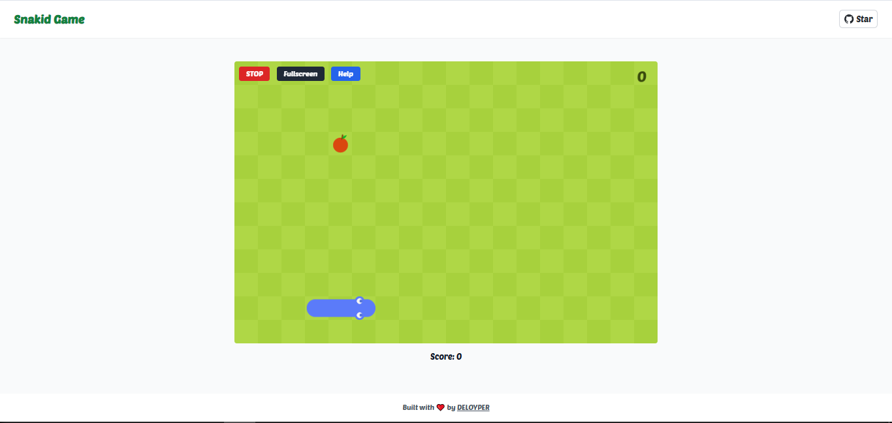

# 🐍 Snakid - A Simple Classic Texture-Based Snake Game

Welcome to **Snakid**, a modern twist on the classic Snake game!  
Built with ❤️ for the web using **HTML5**, **CSS3**, and **JavaScript**, with added texture-based visuals and a clean, glassy UI.

[▶️ Play Now](https://aydope.github.io/snakid/)



## 🎮 Features

- 🍏 Classic snake mechanics with smooth controls
- 🖱️ Control the snake with your **keyboard**
- 📱 Swipe gestures supported on **mobile**
- 🎨 Beautiful glassmorphism-inspired UI
- ⚡ Fast performance with minimal dependencies

---

## 🛠️ Tech Stack

- Vanilla **JavaScript (ES6+)**
- **HTML5 Canvas** for rendering
- **CSS3** with custom fonts and `backdrop-filter` effects
- Font Awesome + Normalize.css + Reset.css

---

## 📲 Controls

| Device  | Controls               |
| ------- | ---------------------- |
| Desktop | Arrow keys `↑ ↓ ← →`   |
| Mobile  | Swipe in any direction |

---

## 🚀 Getting Started

Clone the repo and open `index.html` in your browser:

```bash
git clone https://aydope.github.io/snakid/
cd snakid
open index.html # or use Live Server
```

---

## 🌟 Support & Contributions

If you like Snakid, feel free to ⭐️ this repo and share it with your friends!
You can also contribute by forking the repo and submitting a pull request.
Every little support means a lot! 🙌

---

#### Got questions? [Drop me a message anytime!](https://discord.gg/f9FwaqMvbW)
